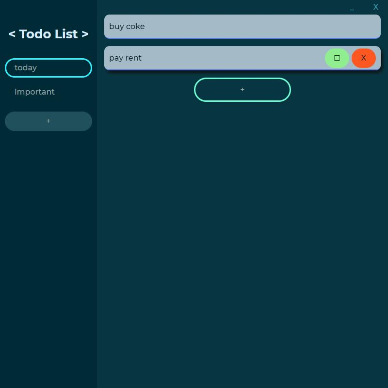
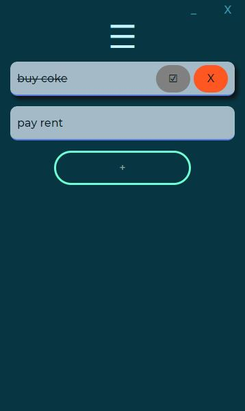

# Todo-simple
Electron based web page todo. With pure HTML, CSS and JavaScript.
It can also run on browsers once you delete the `require('electron')` line in `renderer/main.js`.

## Screen shots

and in a narrower size,

## Functions
- add, edit, remove, and check a todo item in your list.
- add more lists.
- data stored in `localStorage`.

## Todo

- [x] remove list.
- [x] maintain checked/unchecked status of each item.
- [x] responsive layout (CSS).
- [x] more colorful layout design.
- [ ] Electron publication configurations
